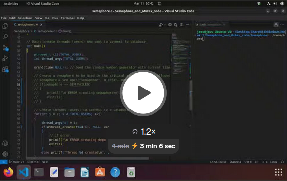

# Semaphore and Mutex

## Semaphore program

This simple program shows how to restrict threads from entering into a critical area of code by using semaphores to limit the amount of threads that can in the critical area at one time. I restrict them to 10 by with this code:
`semaphore = sem_open("Semaphore", O_CREAT, 00644, 10);`
10 as the last argument means that this semaphore will allow up to 10 concurrent threads into the critical section.
Then, when the threads are created using a for loop and pthread_create, they all begin running the connect() function. The connect() function contains the critical region. sem_wait allows a thread in and then decrements the number of available openings that are left. When there are 10 threads in the critical region, then it stops letting threads in. When a thread is finished in the critical region, they call the sem_post function which adds 1 to the available opening and then the semaphore lets a new thread in.

Video:

